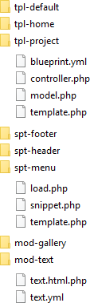

# Kirby Bricks

*Version: 2.2 - [Changelog](docs/changelog.md)*

Create your site with a modular approach. Bundle files together as bricks. Because the bricks is in one place, there are less jumping around between folders.

## Example

*Not every possible file type is included in the example below*

## Table of Contents

1. [Install](docs/install.md)
1. [Folders](docs/folders.md) 
1. [Files](docs/files.md)
1. [Extension registry](docs/registry.md)

## In short

- **Requirement** - [Kirby](https://getkirby.com/) 2.4+
- **License**: https://opensource.org/licenses/MIT
- **Disclaimer**: Use it at your own risk

## Credits

- [Jens Törnell](https://github.com/jenstornell) - Author
- [Christian Zehetner](https://github.com/seehat) - For providing a nice assets route solution.
- [Pedro Borges](https://github.com/pedroborges) and [Sonja Broda](https://github.com/texnixe) for help on improving my namespaces.
- [Lukas Bestle](https://github.com/seehat) - For creating the [Module](https://github.com/getkirby-plugins/modules-plugin) plugin with support for register a module.
- [Bastian Allgeier](https://github.com/bastianallgeier) - For creating the [Patterns](https://github.com/getkirby-plugins/patterns-plugin) plugin which was an inspiration source for Bricks.